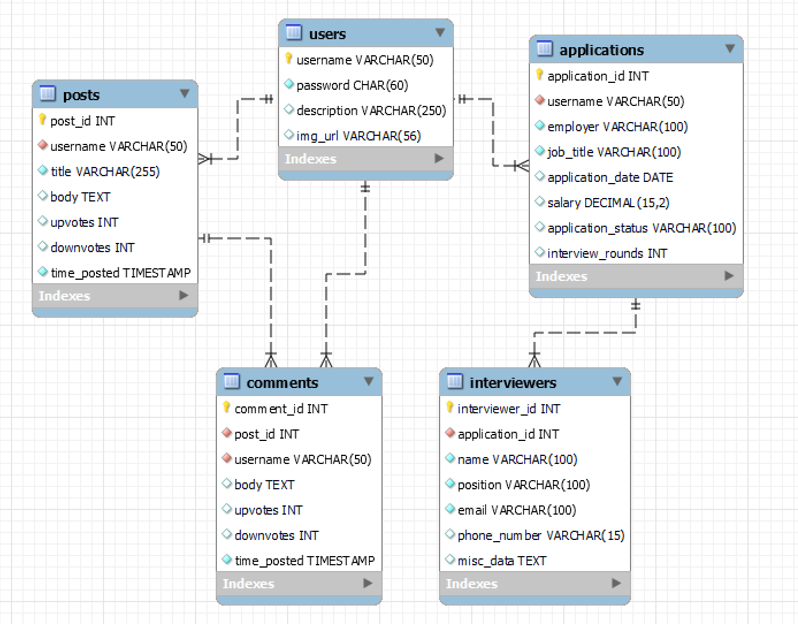

# Career Compass
## Description
Career Compass is a community-driven application finder and tracker.

## Contributors
- Owen Witkos
- Isiah Smith
- Carli Repass
- Brice Parrott
- Jackson Hill
- Calvin Bonomo

## Tech Stack
### Back-end:
- NodeJS
- ExpressJS
- PostgreSQL

### Front-end:
- Handlebars
- Bootstrap

## Dependencies:
- Git
- Docker
- Docker Compose
- NodeJS/NPM

## How to Compile:
```

// Clone the repository to
// your chosen directory.
git clone https://github.com/Calvin-Bonomo/CSCI3308_Project.git

// In the same directory, create
// a .env file with the following
// fields:
// POSTGRES_USER="YOUR USERNAME"
// POSTGRES_PASSWORD="YOUR PASSWORD"
// POSTGRES_DB="YOUR DATABASE NAME"
// SESSION_SECRET="YOUR SESSION SECRET"

// May need to use sudo for Linux
// or docker-compose for older versions
// of Docker Compose
docker compose up
```

## How to run tests:
Tests, should be enabled by default, but, if disabled, navigate to the `docker-compose.yaml` file in the root directory, and change the `command` field to `npm run testandrun`.

## Deployed App Link:
https://csci3308-project.onrender.com/

## Change Log 11/15

#### Completed:  
* set up handlebars  
* implement more modular testing so each test can be a different file  
* implement header/footer partials (website modularity)  
* implemented partials needed for page rendering (HTML/HBS skeleton pages)  
* implemented tests-cases for the get method for all pages and routes  

#### To Do:  
* implement routes for post methods  
* register/login  
* dynamic element generation from database queries  
* tests for each new feature  

## Change Log 11/8

#### Completed:  
* finished setting up docker-compose.yaml  
* got test cases working  
* created the sql databases  
* updated our InitData folder  

#### To Do:  
* ✔ more functionally modular website  
* ✔ HTML skeleton pages  
* ✔ set up handlebars  

## ER Diagram


